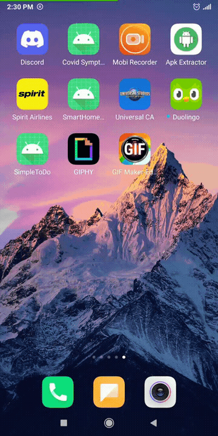

# *Simple Todo App*

Simple Todo App is an android application which allows users to create a todo list by adding/modifying items in the list. The list is persisted in the storage.

Developed by: **Rohit Vishwanath Badugu**

Time spent: **8** hours spent in total

## User Stories

The following **required** functionality is completed:

* [X] User can view the list of to-do items
* [X] User can add/delete items in the list
* [X] The list items are persisted and the list is retrieved on app restart.

The following **optional** features are implemented:

* [X] User can edit a list item. Tapping on a list item opens a new screen for user to edit the text. On save, this change is reflected in the main screen list.

The following **additional** features are implemented:

* [ ] List anything else that you can get done to improve the app functionality!

## Video Walkthrough

Here's a walkthrough of implemented user stories:

GIF created with [GIF Maker, GIF Editor](https://play.google.com/store/apps/details?id=com.media.zatashima.studio&hl=en_US&gl=US).

## Notes

Describe any challenges encountered while building the app.

1. Understanding workings of list adapter
2. Gradle issues

## License

    Copyright [yyyy] [name of copyright owner]

    Licensed under the Apache License, Version 2.0 (the "License");
    you may not use this file except in compliance with the License.
    You may obtain a copy of the License at

        http://www.apache.org/licenses/LICENSE-2.0

    Unless required by applicable law or agreed to in writing, software
    distributed under the License is distributed on an "AS IS" BASIS,
    WITHOUT WARRANTIES OR CONDITIONS OF ANY KIND, either express or implied.
    See the License for the specific language governing permissions and
    limitations under the License.
